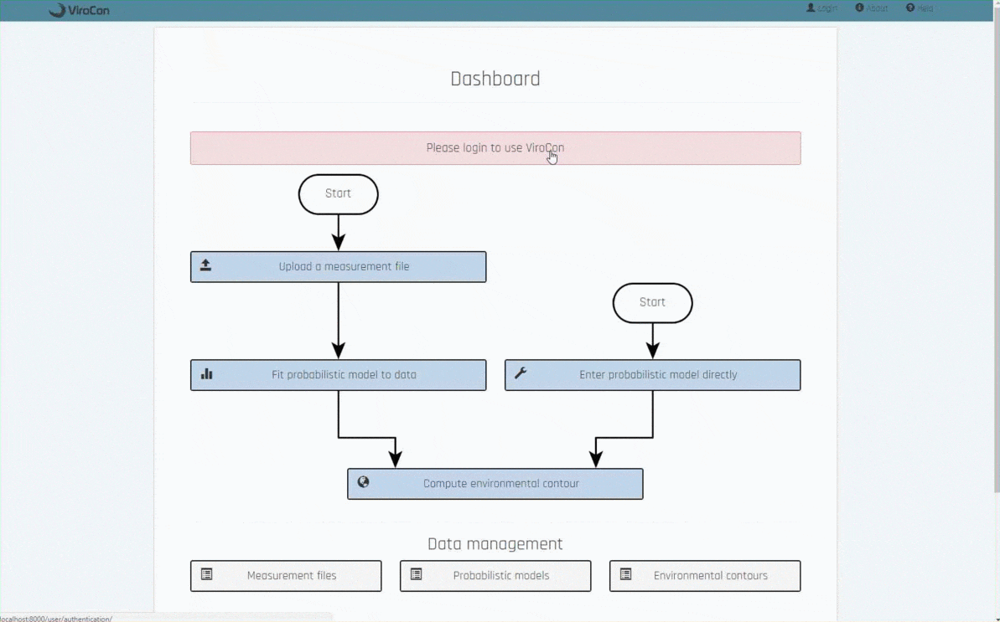

# ViroCon

[](https://travis-ci.org/ahaselsteiner/viroconweb)
[](https://coveralls.io/github/ahaselsteiner/viroconweb?branch=master)

ViroCon is an easy-to-use web-based software to compute environmental contours.

## About

This is the code of the web application ViroCon.

ViroCon helps you to design marine structures, which need to withstand load
combinations based on wave, wind and current. It lets you define extreme
environmental conditions with a given return period using the environmental
contour method.

The following methods are available:
* Fitting a probabilistic model to measurement data using maximum likelihood
estimation
* Defining a probabilistic model with the conditonal modeling approach (CMA)
* Computing an environmental contour using either the
  * inverse first order reliability method (IFORM) or the
  * highest density contour (HDC) method

ViroCon is written in Python 3.6.4 and uses the web framework Django 1.11.11.
 The software is seperated in two main packages, viroconweb and viroconcom.
 This is the repository of viroconweb, which is the web application.
 The second package, viroconcom, handles the statistical computations and
 has its own [repository](https://github.com/ahaselsteiner/viroconcom).

## How to use ViroCon



To run a copy of ViroCon locally use the following commands:
```
git clone https://github.com/ahaselsteiner/viroconweb
pip install -r requirements.txt
python manage.py collectstatic
python manage.py migrate
python manage.py runserver
```
Then you should reach a local version of ViroCon at http://localhost:8000


If you don't want to work with viroconweb's graphical userer interface, but
want to compute environmental contours with Python, use the package we
built for the needed statistical computations,
[viroconcom](https://github.com/ahaselsteiner/viroconcom).

## Documentation
**Code.** The code's documentation can be found
[here](https://ahaselsteiner.github.io/viroconweb/).

**Methods.** The app has a help page, which describes the implemented methods in
detail. If you runt he app it can be found at http://localhost:8000/info/help.
Its template is located
[here](https://github.com/ahaselsteiner/viroconweb/blob/master/info/templates/info/help.html).

**Paper.** We are currently writing an academic paper describing ViroCon. We will
provide a link to it here.

## Contributing
There are various ways you can contribute. You could
 * improve the code,
 * improve the documentation,
 * add a feature or
 * report a bug or an improvement and leave it to us to implement it.

**Issue.** If you spotted a bug, have an idea for an improvement or a new
 feature please open a issue. Please open an issue in both cases: If you want to
 work on in yourself and if you want to leave it to us to work on it.

**Fork.** If you want to work on an issue yourself please fork the repository,
then develop the feature in your copy of the repository and finally
file a pull request to merge it into our repository.

**Conventions.** In our [Contribution Guide](https://ahaselsteiner.github.io/viroconweb/styleguide.html)
we summarize our conventions, which are consistent with PEP8.

## License
This software is licensed under the MIT license. For more information, read the
file [LICENSE](https://github.com/ahaselsteiner/viroconweb/blob/master/LICENSE).